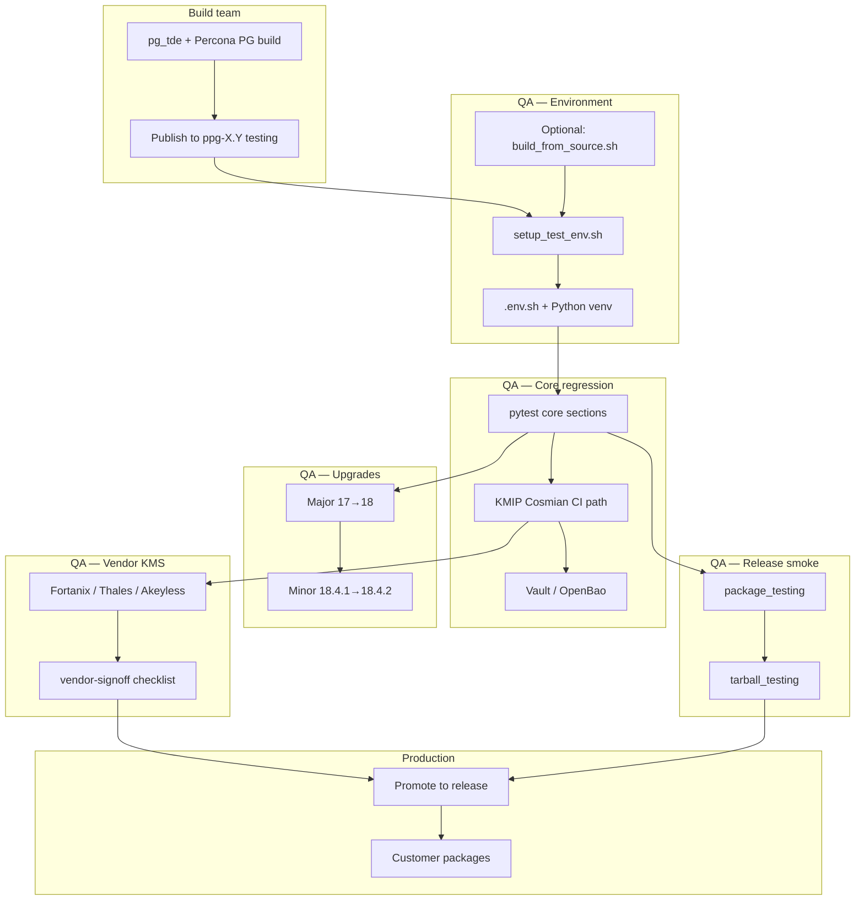

# pg_tde QA — End-to-End Workflow

> **Audience:** Build team, release management, engineering leadership  
> **Executive summary:** [qa_workflow_executive_summary.md](qa_workflow_executive_summary.md)  
> **Test coverage summary:** [qa_test_coverage_executive_summary.md](qa_test_coverage_executive_summary.md)  
> **Modules by area (no filenames):** [qa_test_modules.md](qa_test_modules.md)  
> **Platform example:** Ubuntu 26.04 x86_64 (same flow applies to other Linux targets in `package_testing/`)

This document describes the full QA cycle for **Percona PostgreSQL with pg_tde**:
from build-team handover through package validation to production promotion.

---

## 1. Purpose

QA validates that pg_tde packages are correct, upgrade-safe, and compatible with
supported external key providers (KMIP, Vault KV, OpenBao) before they move from
**testing** to **release** in Percona repositories.

The primary harness is **pytest** under `postgresql/pytest/`. Legacy bash
automation and Vagrant smoke tests provide Jenkins parity and multi-OS coverage.

---

## 2. Roles and handover

| Role | Responsibility | Delivers to QA |
|------|----------------|----------------|
| **pg_tde engineering** | Features, meson/TAP tests, upstream CI | Source branches, package builds |
| **Build / release engineering** | Percona PostgreSQL + pg_tde packages | Packages in `ppg-X.Y` (`testing` → `release`) |
| **QA** | Integration, regression, upgrade, KMS sign-off | Pass/fail, vendor checklist, promotion recommendation |
| **Release manager** | Repo tier promotion | Customer-facing packages |

**Handover trigger:** QA receives either:

- **Package handover** — e.g. `percona-postgresql-18` + `percona-pg-tde18` in `ppg-18.4` **testing**, or
- **Source handover** — validate a branch before packages are cut.

### Version terminology

| Name | Meaning | Example |
|------|---------|---------|
| `PG_MAJOR` | Integer PostgreSQL major | `18` |
| `PG_REPO_LINE` | Percona repo line | `18.4` → `ppg-18.4` |
| `SERVER_VERSION` | Patch from `postgres --version` | `18.4.1` |
| `REPO_COMPONENT` | Repo tier | `testing`, `release`, `experimental` |

---

## 3. End-to-end flow



---

## 4. Phase 0 — Build handover checklist

QA should record at handover:

| Item | Example |
|------|---------|
| PostgreSQL major | `18` |
| Repo line | `ppg-18.4` |
| Patch versions | `18.4.1` (release), `18.4.2` (testing) |
| Components | `server`, `pg_tde`, `pg_backrest` |
| Build reference | Git SHA, package version, Jenkins build # |
| QA owner | Name, VM/host, start date |

---

## 5. Phase 1 — Lab setup (Ubuntu example)

**Where:** QA VM (e.g. AWS Ubuntu)  
**Repo:** `git clone https://github.com/percona/percona-qa.git`

### Path A — Package install (production parity) — default for release QA

```bash
cd percona-qa/postgresql/pytest
bash setup_test_env.sh --install-pkgs \
  --pg-major 18 \
  --pg-repo-line 18.4 \
  --repo-component testing \
  --components server,pg_tde,pg_backrest

source .env.sh
```

**`setup_test_env.sh` steps:**

1. User check (non-root; uses `sudo` for packages)
2. `percona-release enable-only ppg-18.4 testing` + `apt install`
3. Detect `INSTALL_DIR` (e.g. `/usr/lib/postgresql/18`)
4. Verify `pg_tde.control`, pgBackRest
5. Python 3.9+ venv at `.venv`
6. Install pytest dependencies (`pyproject.toml`)
7. Optional Cosmian KMS + OpenBao (`install_cosmian_kms.sh`, `install_openbao.sh`)
8. Write `.env.sh`
9. Smoke: `initdb` → start PG → `CREATE EXTENSION pg_tde`

See `setup_test_env.sh --help` for all options.

### Path B — Source build (pre-package / dev)

```bash
cd postgresql/pytest
bash build_from_source.sh          # or --tde-only, --clean
source /home/ubuntu/pgwork/pg_env.sh
bash setup_test_env.sh --install-dir "$INSTALL_DIR"
source .env.sh
```

Default workdir: `/home/ubuntu/pgwork` (`pginst/18`, `pg_tde`, `tde_build`).

### Path C — Docker (isolated)

```bash
cd postgresql/pytest
bash run_tests.sh                  # package image
bash run_tests.sh --source         # source build in container
```

See [docker/README.md](docker/README.md).

---

## 6. Phase 2 — Core regression (pytest)

**Entry:** `source .env.sh` → `pytest tests/`

| Layer | Location | Scale |
|-------|----------|-------|
| Primary suite | `tests/` | ~29 modules, 500+ tests |
| Section control | `--skip-sections` | [test_sections.md](test_sections.md) |
| Full catalog | `coverage_reports/test_catalog_2026-07-29.md` | Per-test inventory |
| PITR coverage | `coverage_reports/coverage_2026-07-29.md` | Cold copy / basebackup / pgBackRest PITR |

### Recommended order (fresh VM)

```bash
cd postgresql/pytest && source .env.sh

# Core (skip long upgrade sections on first pass)
pytest tests/ -v --skip-sections=upgrade,minor_upgrade,slow

# Feature areas
pytest tests/ -m encryption -v
pytest tests/ -m rewind -v
pytest tests/ -m "backup or recovery or replication" -v
```

### Test sections

| Section | Marker | Content |
|---------|--------|---------|
| `encryption` | `encryption` | TDE tables, keys, rotation |
| `rewind` | `rewind` | `pg_tde_rewind` scenarios |
| `upgrade` | `upgrade` | Major `pg_upgrade` + `pg_tde_upgrade` |
| `minor_upgrade` | `minor_upgrade` | In-place patch bump |
| `kmip` | `kmip` | KMIP providers — [kmip/README.md](kmip/README.md) |
| `vault` / `openbao` | `vault`, `openbao` | Vault KV v2, OpenBao — [vault.md](vault.md) |
| `pgbackrest` | `pgbackrest` | Backup with encrypted data |
| `waldump` | `waldump` | WAL encryption / `pg_tde_waldump` |

```bash
pytest --list-test-sections
pytest tests/ --skip-sections=rewind,upgrade,vault -v
```

---

## 7. Phase 3 — External key providers

### 7a. Automated CI path (every build)

| System | Setup | Tests |
|--------|-------|-------|
| Cosmian KMS | `scripts/setup_cosmian_for_pytest.sh` | `scripts/run_kmip_revalidation.sh` |
| OpenBao | `scripts/setup_openbao_for_pytest.sh` | `scripts/run_openbao_revalidation.sh` |

Cosmian/OpenBao can auto-start at pytest session start (`lib/external_key_providers.py`).
Opt out: `PG_TDE_SKIP_EXTERNAL_KEY_PROVIDERS=1`.

### 7b. Vendor KMS sign-off (scheduled / release)

See [kmip/vendor-signoff.md](kmip/vendor-signoff.md).

| Vendor | Profile | Env prefix | Lab setup |
|--------|---------|------------|-----------|
| Fortanix DSM | `fortanix` | `KMIP_FORTANIX_*` | [kmip/vendor-lab-fortanix.md](kmip/vendor-lab-fortanix.md) |
| Thales CipherTrust | `thales` | `KMIP_THALES_*` | `scripts/setup_ciphertrust_kmip.sh` |
| Akeyless | `akeyless` | `KMIP_AKEYLESS_*` | Docker Gateway + KMIP client RBAC |
| Vault KMIP engine | `vault_kmip` | `KMIP_VAULT_*` | Lab only — [kmip/vault-kmip-engine.md](kmip/vault-kmip-engine.md) |

```bash
export KMIP_PROFILE=thales    # or fortanix, akeyless, vault_kmip
./scripts/run_kmip_matrix.sh
```

**Production Vault path:** Vault **KV v2** (not KMIP engine) — [vault.md](vault.md),
`scripts/run_vault_kv_matrix.sh`.

Template: `config/kmip_profiles.example.env`.

---

## 8. Phase 4 — Upgrade testing

### 8a. Major upgrade (PostgreSQL 17 → 18)

| Tool | Path |
|------|------|
| Staged workflow | `run_major_upgrade_workflow.sh` |
| Bash matrix | `run_tde_upgrade_parallel.sh` |
| Pytest | `pytest -m upgrade tests/test_tde_pg_upgrade.py -v` |

Docs: [major_upgrade.md](major_upgrade.md), [ci_upgrade_scenarios.md](ci_upgrade_scenarios.md)

**Jenkins:** `tde-upgrade-parallel` on `https://pg.cd.percona.com/` (VPN)

### 8b. Minor upgrade (in-place patch, e.g. 18.4.1 → 18.4.2)

| Tool | Path |
|------|------|
| Full workflow | `run_minor_upgrade_workflow.sh` |
| Pytest | `tests/test_tde_minor_upgrade.py` |

Docs: [minor_upgrade.md](minor_upgrade.md)

Phases: install old packages → Setup tests → `apt/yum` upgrade → Verify tests →
`ALTER EXTENSION pg_tde UPDATE`.

Data dir: `PG_TDE_UPGRADE_DATA_DIR` (default `/var/lib/pg_tde_minor_upgrade`).

---

## 9. Phase 5 — Legacy automation and TAP

| Layer | Path | When |
|-------|------|------|
| Bash automation | `postgresql/automation/wrapper/test_runner.sh` | Jenkins major-upgrade matrix |
| Upgrade testing | `postgresql/upgrade_testing/wrapper/` | Additional upgrade scripts |
| TAP Perl | `postgresql/t/` | Installcheck-world parity with upstream pg_tde |

pg_tde engineering runs meson TAP (`t/kmip.pl`, etc.) in the pg_tde repo; percona-qa
pytest is the deeper integration layer on Percona packages.

---

## 10. Phase 6 — Multi-OS release smoke

**Where:** Vagrant (QA or release engineer)  
**Paths:** `postgresql/package_testing/`, `postgresql/tarball_testing/`

```bash
cd postgresql/package_testing
REPO=testing PG_VERSION=18.4 bash package_test.sh

cd postgresql/tarball_testing
PG_VERSION=18.4 bash tarball_test.sh
```

Matrix includes Debian 11/12, OL8/9, Ubuntu 22/24 (and variants). Each OS:
provision → install → SQL smoke → uninstall.

---

## 11. Phase 7 — Sign-off and production promotion

### QA exit criteria

| Gate | Evidence |
|------|----------|
| Core pytest green | `pytest tests/` log |
| Cosmian KMIP | `run_kmip_revalidation.sh` |
| OpenBao / Vault KV | `run_openbao_revalidation.sh`, `run_vault_kv_matrix.sh` |
| Major upgrade | `tde-upgrade-parallel` or `run_tde_upgrade_parallel.sh` |
| Minor upgrade | `run_minor_upgrade_workflow.sh` |
| Vendor KMS (release) | [vendor-signoff.md](kmip/vendor-signoff.md) checklist |
| Multi-OS smoke | `package_testing` / `tarball_testing` |

### Promotion path

```
experimental → testing → release → customer mirrors
```

QA recommends **testing → release** after gates pass. Release engineering executes
tier promotion and publishing.

---

## 12. Jenkins / CI reference

| Job | Purpose |
|-----|---------|
| `tde-upgrade-parallel` | Major upgrade bash matrix |
| `pg-tde-kmip-ci` | Cosmian KMIP every build |
| `pg-tde-kmip-fortanix` | Weekly Fortanix sign-off |
| `pg-tde-kmip-thales` | Weekly Thales sign-off |
| `pg-tde-kmip-akeyless` | Weekly Akeyless sign-off |

Host: `https://pg.cd.percona.com/` (Percona VPN). Pipeline definitions are documented
in [ci_upgrade_scenarios.md](ci_upgrade_scenarios.md) and [kmip/ci-strategy.md](kmip/ci-strategy.md).

---

## 13. One-day quick reference (Ubuntu VM)

```bash
cd percona-qa/postgresql/pytest
bash setup_test_env.sh --install-pkgs --pg-major 18 --pg-repo-line 18.4 --repo-component testing
source .env.sh

pytest tests/ -v --skip-sections=upgrade,minor_upgrade,slow
./scripts/run_kmip_revalidation.sh
source scripts/setup_openbao_for_pytest.sh && ./scripts/run_openbao_revalidation.sh

# Vendor KMS (as needed)
KMIP_PROFILE=thales ./scripts/run_kmip_matrix.sh
KMIP_PROFILE=akeyless ./scripts/run_kmip_matrix.sh

# Upgrades (when both versions installed)
bash run_minor_upgrade_workflow.sh
bash run_tde_upgrade_parallel.sh
```

---

## 14. Documentation map

| Topic | File |
|-------|------|
| Test sections | [test_sections.md](test_sections.md) |
| Major upgrade | [major_upgrade.md](major_upgrade.md) |
| Minor upgrade | [minor_upgrade.md](minor_upgrade.md) |
| CI upgrade matrix | [ci_upgrade_scenarios.md](ci_upgrade_scenarios.md) |
| Upgrade test catalog | [upgrade_matrix.md](upgrade_matrix.md) |
| KMIP | [kmip/README.md](kmip/README.md) |
| Vendor KMS sign-off | [kmip/vendor-signoff.md](kmip/vendor-signoff.md) |
| Vault KV | [vault.md](vault.md) |
| Key provider layout | [key_provider_matrix.md](key_provider_matrix.md) |
| Docker tests | [docker/README.md](docker/README.md) |
| io_uring host setup | [io_uring_system_setup.md](io_uring_system_setup.md) |
| Full test catalog | [coverage_reports/test_catalog_2026-07-29.md](../coverage_reports/test_catalog_2026-07-29.md) |
| PITR coverage report | [coverage_reports/coverage_2026-07-29.md](../coverage_reports/coverage_2026-07-29.md) |
| Environment setup | `../setup_test_env.sh` |
| Source build | `../build_from_source.sh` |

---

## 15. Tool dependency summary

```
pg_tde build
    ├── Packages / tarballs ──► setup_test_env.sh ──► .env.sh ──► pytest
    ├── Source tree ──────────► build_from_source.sh ────────────┘
    └── Upstream TAP (pg_tde repo)

pytest ──┬── Cosmian / OpenBao (auto or scripts/)
         ├── Vendor KMIP matrix (Fortanix, Thales, Akeyless)
         ├── Upgrade workflows (major + minor)
         └── Jenkins (pg.cd.percona.com)

package_testing / tarball_testing ──► release promotion
```
